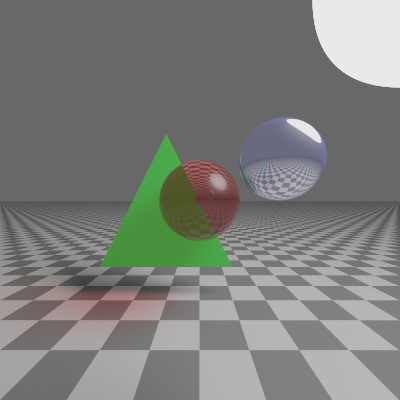
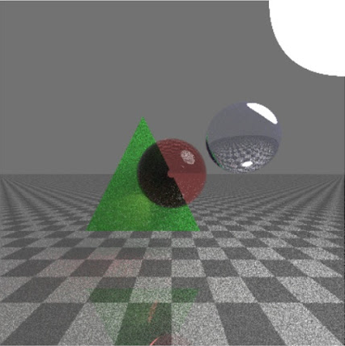
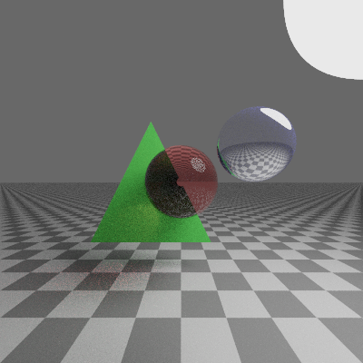

# Physically-Based Dual-Engine Renderer

A high-performance C++ rendering engine capable of switching between deterministic Whitted Ray Tracing and probabilistic Monte Carlo Path Tracing. Developed to explore the intersection of multivariable calculus, numerical analysis, and light transport physics.

## Overview
This project was developed to improve understanding of Physically Based Rendering concepts that go into making Ray Tracing the impressive tech it is today.

### Key Features
* **Dual-Core Architecture:** Toggleable engines for comparing classic recursive ray tracing with modern path-traced global illumination.
* **Next Event Estimation (NEE):** Optimized light sampling that significantly reduces noise by explicitly sampling light sources at every bounce, resulting in 10x faster convergence compared to classical Monte Carlo Path Tracing.
* **Physically-Based Materials:** 
  * **Diffuse:** Lambertian reflectance model.
  * **Specular:** Perfect reflection using Fresnel equations.
  * **Dielectric:** Refraction based on Snell’s Law and Schlick’s Approximation for glass/water effects.
* **Dynamic Path Management:** Integrated Russian Roulette termination for unbiased, efficient recursion depth control.
* **Post-Processing Pipeline:** Built-in Reinhard Tone Mapping and Gamma Correction (2.2) for perceptual color accuracy.

## The Mathematics
Prioritized the physical aspect of light transport:
* **Uniform Hemisphere Sampling:**  Leveraging Probability Density Functions (PDF) to sample ray directions.
* **Unbiased Integration:** Using Monte Carlo methods to solve the Rendering Equation.
* **Geometric Intersection:** Optimized ray-primitive intersection logic for spheres, triangles, and planes.

## Gallery and Results
| Feature | Whitted Ray Tracing | Path Tracing (Naive) | Path Tracing (NEE) |
| :--- | :---: | :---: | :---: |
| **Output** |  |  |  |
| **Description** | Deterministic; perfect reflections/refractions but hard shadows. | Stochastic; soft shadows and global illumination, but high noise. | Optimized light sampling; achieves smooth results with 10x fewer samples. |

